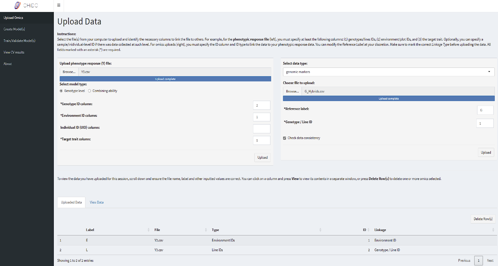
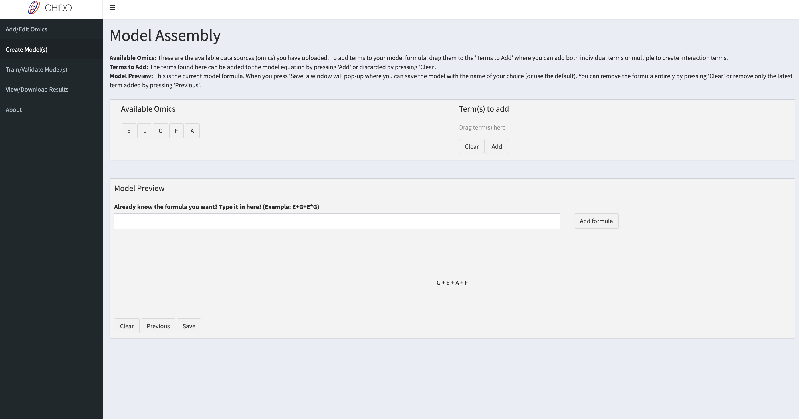
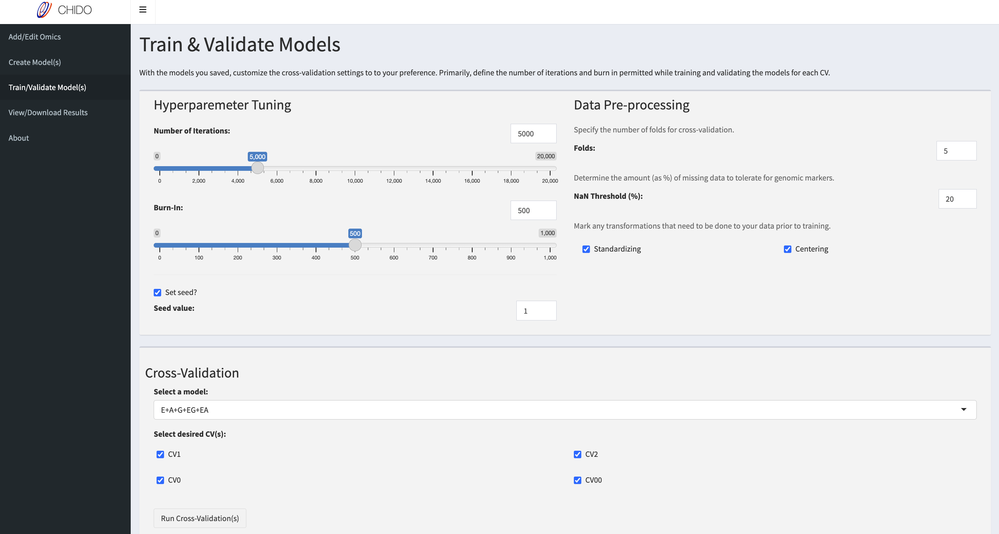

# CHiDO

**Characterization and Integration of Driven Omics**

## Description

CHiDO is a no-code application developed by the Jarquin Lab at the
University of Florida's Department of Agronomy. The application aims to
remove technical and financial barriers associated with modeling
Genotype-by-Environment (GxE) interactions.

There is a demo version of CHiDO hosted as a free web application at:
<https://jarquinlab.shinyapps.io/chido/>

## Authors

-   Francisco González - University of Florida (UF)
-   Julián García - Universidad Politécnica de Madrid (UPM)
-   Dr. Diego Jarquin - University of Florida (UF)

## Installation

### Prerequisites

The following packages, listed in `requirements.txt`, are necessary to
run CHiDO locally: - shiny - shinyjs - shinyjqui - shinydashboard -
dplyr - ggplot2 - viridis - scales - gridExtra - DT - zip - markdown -
BGLR

Once you clone/download the repository, ensure you are in the CHiDO
directory and run the following command in the terminal:

``` r
Rscript -e 'packages <- readLines("requirements.txt"); for(package in packages) if (!require(package, character.only = TRUE)) install.packages(package, dependencies = TRUE)'
```

This will ensure all prerequisite libraries and any of their
dependencies are installed in your local environment.

### Step-by-step Guide

1.  Clone the repository:
    `git clone https://github.com/jarquinlab/CHiDO.git`
2.  Navigate to the project directory: `cd CHiDO`
3.  Install required packages by using the command mentioned in the
    **Prerequisites** section.
4.  Run the application: `shiny::runApp()` or pressing "Run App" in
    RStudio.

## Usage

There are four main steps for using CHiDO: (1) loading the data, (2) building models
with the data, (3) training/testing the models, and (4) viewing/downloading results.

### 1/ Loading the data

#### Minimum requirements

Data format supported: CSV

Data size limits: 50MB

At minimum, users must upload a file with the following columns:
- __Genotype ID:__ Identify the genotypic lines that were examined in the field trials, this can be a numeric or non-numeric identifier.
- __Environment ID:__ Identify the environmental unit (e.g. plot) through which the field trials were split, this can be a numeric or non-numeric identifier.
- __Target trait:__ The phenotypic trait to predict. There can be multiple columns for each phenotypic trait but only one can be defined as the target trait per run.

#### Other data files

Additional datasets, or "omics", can be uploaded on the right-hand box of the _Data Upload_ page (image below). These files should have at least one ID column that can be linked back to the file containing the IDs and phenotypic data.





When you upload an omic file, you must specify a label (e.g., G for genomics) and the
column where the IDs are located. If you select "other" as the data type, a dropdown
menu will be displayed where you can select how the ID column should be linked back to the first file.

### 2/ Model assembly

Every omic uploaded will have a label (e.g., G for genomics) and this label will be displayed as a draggable icon in the _Model Assembly_ page. In the top-left box (image below), all omics available will be displayed via their labels and can be added as terms
to a linear mixed model as:

- __Main effects__ by dragging a single label into the top-right box and pressing "Add".
- __Interaction terms__ by dragging two or more labels into the top-right box and pressing "Add" (e.g., G and E are added together and shown as G*E in the model preview).

There is also the option of writing the model directly into a text entry box.



There are three buttons in the model preview section
- __Save:__ Saves the current model and launches a pop-up box to define a name for it.
- __Previous:__ Removes the last term added to the model.
- __Clear:__ Removes all terms

Multiple models can be created and saved.

### 3/ Training and validation



In this section, you can define the parameters and configurations to train and test your saved models. 

__Hyperparameter Tuning__

CHiDO uses the BGLR library to train and fit the models, which uses a Markov Chain
Monte Carlo (MCMC) sampling process. You can adjust this by using the following two
parameters in interface.

- Number of iterations: The total number of MCMC iterations that the algorithm will perform. During these iterations, the algorithm samples from the posterior distribution of the model parameters.

- Burn-in rate: The number of initial iterations that will be discarded from the MCMC sampling process, allowing the algorithm to reach a stable state by discarding early samples that might be biased due to the starting values. Usually, this value ranges anywhere from 10% to 50% of the total iterations. 

You can also set the seed using any fixed number of your choice. 

__Data Pre-processing__

In this section, you can define the number of folds you will split your data into to perform cross-validations. 

Additionally, you can define the _NaN Threshold_ -- this variable corresponds to the limit of NaN values in a column for an omic before discarding that column prior to creating the covariance matrices that are used as model terms. For example, if you have a file containing genomic markers and set the _NaN Threshold_ to 20%, any marker with more than 20% missing values will be discarded.

Currently, we only have two data transformation processes to choose from
- Centering: Subtracting the mean of the variable from each individual value so that the mean of the variable becomes zero.
- Standardizing: Centering the variable and scaling it by its standard deviation to have a mean of zero and a standard deviation of one.

__Cross-Validation__

Finally, in this section you can begin training and testing your model(s) by choosing the model from a drop-down menu and selecting one or more of four cross-validation (CV) schemes. 

In a general sense, these CV schemes are used for the following:
- __CV1__ to predict untested genotypes in observed environments
- __CV2__ to predict tested genotypes in observed environments
- __CV0__ to predict tested genottypes in new environments
- __CV00__ to predict untested genotypes in new environments

For each cross-validation, the data will be sorted following the appropriate methods for it and it will be split into the number of defined folds.

There is a terminal box that, once you press "Run", displays the progress in creating, training, and testing the models. Upon completion, a pop-up box will be displayed notifying that results from the cross-validation are ready.

### 4/ Viewing and downloading results

You can view your results in two methods, as tables or graphs. In addition to the CV results, you also have the following evaluation metrics:
- Prediction accuracy
- Root-mean-square-error (RMSE)
- Variance components

These results can be downloaded as a zip folder and the contents are split by model tested. For each model, there will be CSV files containing the raw results for each CV selected, PNG files with images of the plots generated, an RDA object containing the fitted model, and RDS files for each plot (created with ggplot2). A sample output can be located in the [example](https://github.com/jarquinlab/CHiDO/example) folder.

## Contact

For questions about using CHiDO, please visit our
[documentation](https://github.com/jarquinlab/CHiDO/docs) page for
guidance.

If you encounter any issues with the application or have an idea to
extend its capabilities, please submit it to our GitHub issues page,
found [here](https://github.com/jarquinlab/CHiDO/issues).

For any additional concerns or interest in collaborating with the
project, please email Dr. Diego Jarquin
([jhernandezjarqui\@ufl.edu](mailto:jhernandezjarqui@ufl.edu){.email}).
